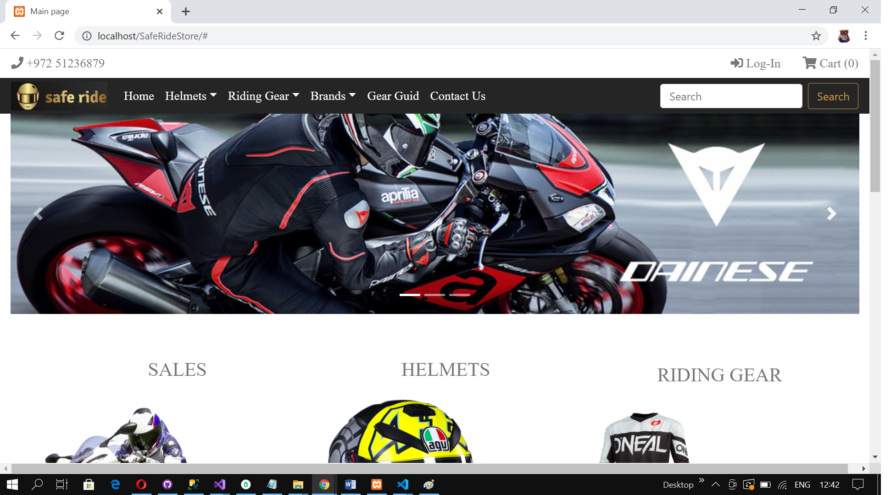
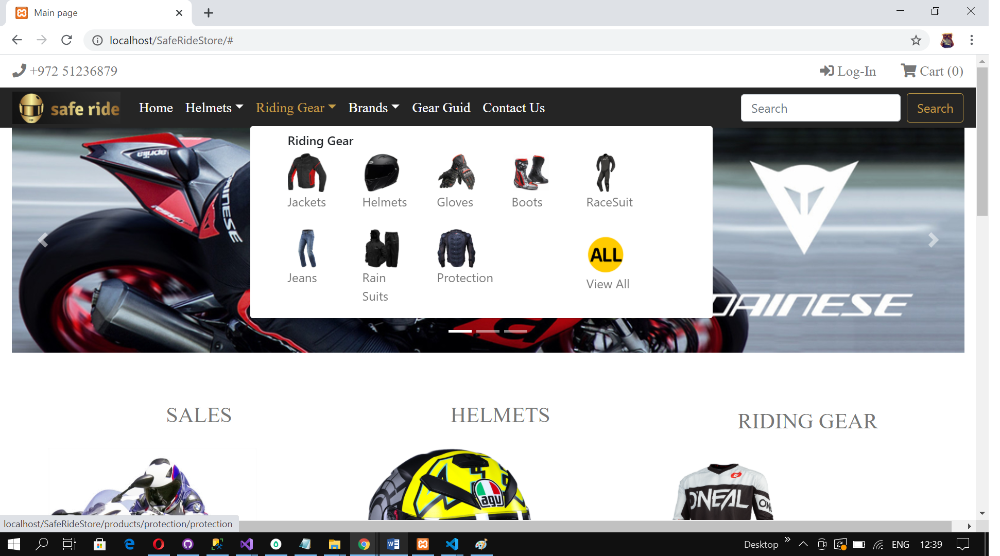
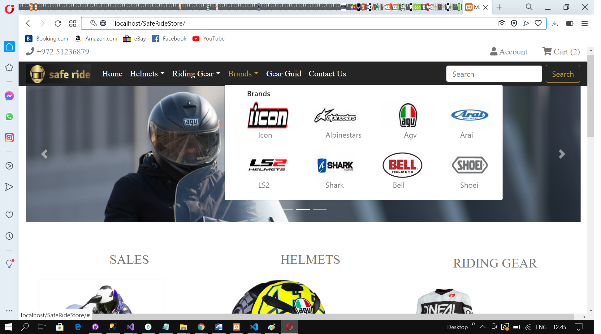
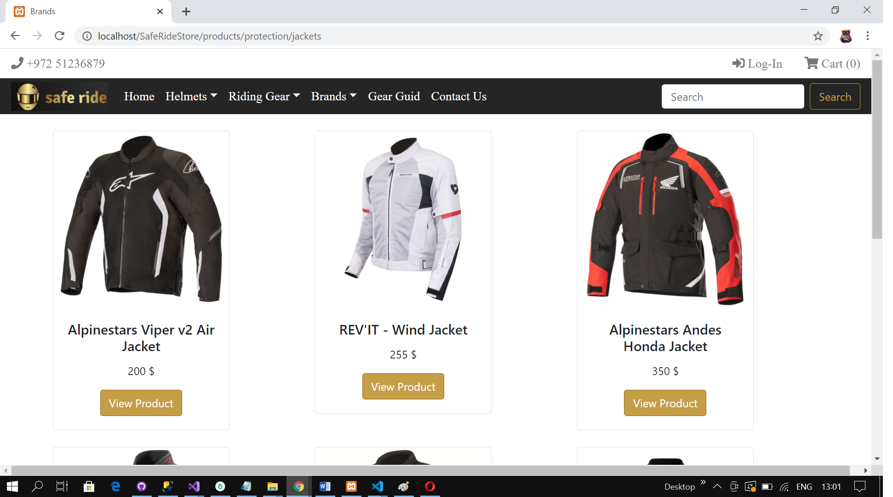
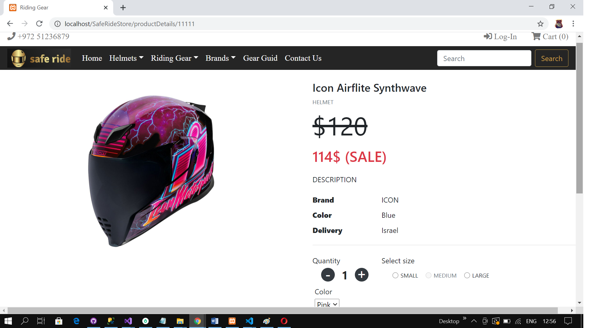
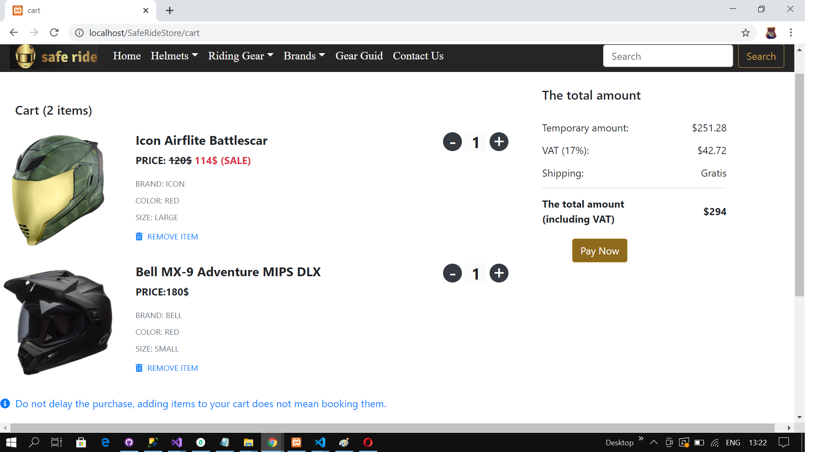
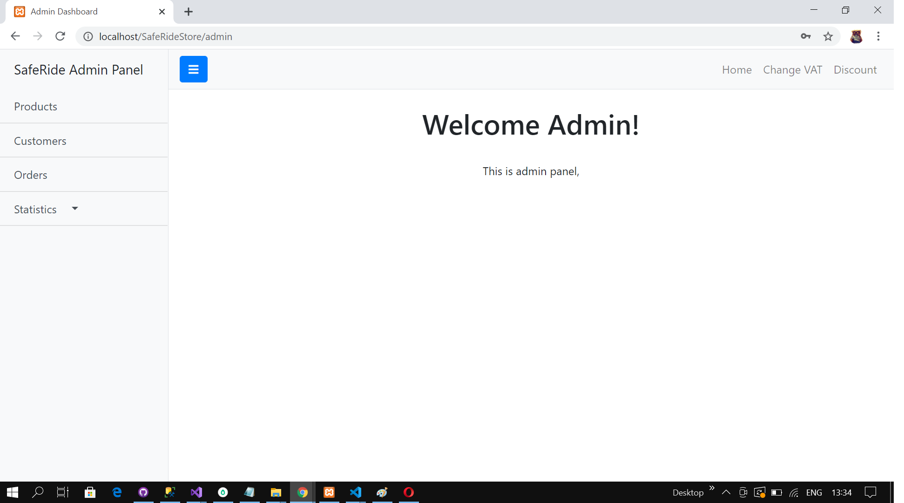
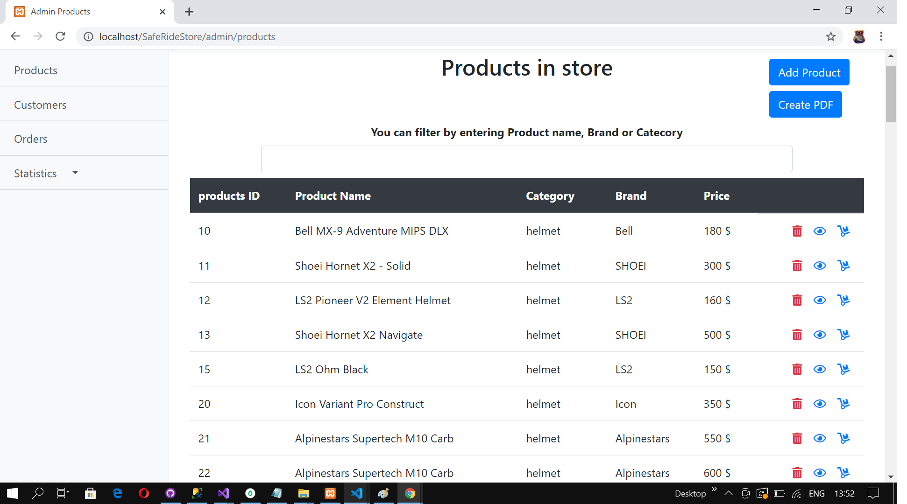
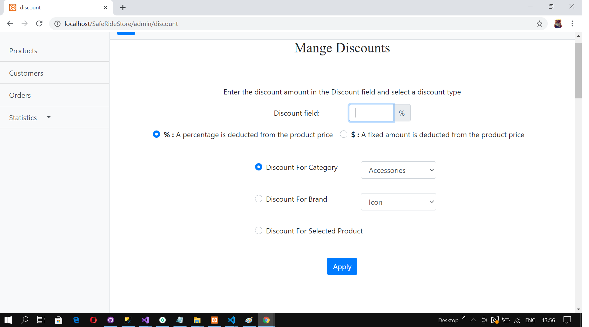
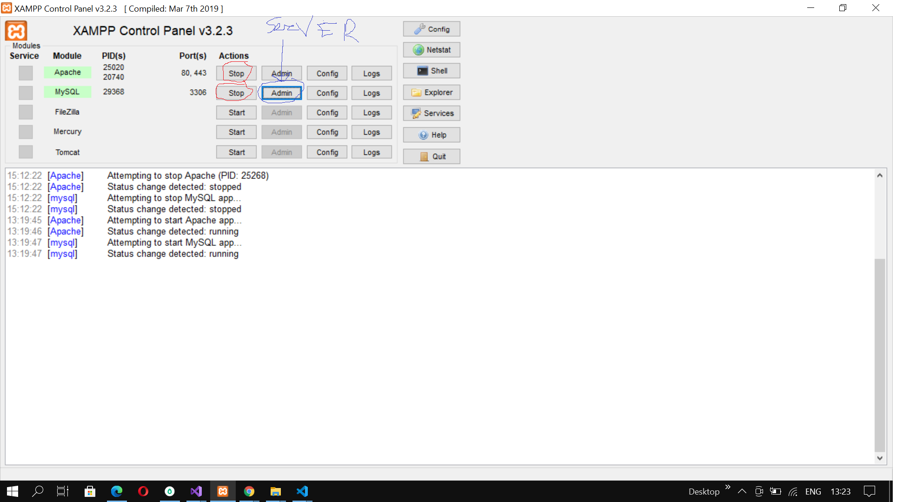

# Safe Ride Store

## About our Project.

*Technologies* :
+ **Languages:**
  + **PHP**
  + **JavaScript**
  + **JQuery**
+ **Front End**:
  + **HTML5**
  + **CSS**
  + **Bootstrap**
+ **Database**:
  +  **MySQL**
  +  **Xampp Local Server** 
+ **Design Pattern**:
  + **MVC**
___
##  Main Page.
___
***Main page***


## Before Registration.
+ *Before Registration you can see different products and sections.*<br>
  
***Riding Gear Sections***

***Brands***


***Jackets***


+ *You  can see specific product.*
  
***Helmet***
 

+ *But you can`t add to Cart/Buy any product before registration or loggin.*

## Registration
___
+ *After correct filling registration form user will be added to MySQL Data Base*
 
## After Registration/Loggin.
___
+ **You can:**
  + *Add Products to cart.*
  + *Buy Products.*
  + *Remove products from Cart.*
  + *Edit Profile.*
  + *Change Password.* 

  *P.S Ofcourse by this actions , changes will occur data base.*

***Cart***
 

## After loggin as *Administrator*.
___
***Admin Panel***
 

+ **Administrator can:**
  + *Use all actions that logged user can do.*
+ **Specific Administrator actions**
  + **Products**
      + *Add Products to Store.*
      + *Edit Product information*
      + *Remove Product from Store.*
  + **Customers**
      + *See custumer information*
  + **Orders.**
    + *See sale Statistic*
    + *See all Orders*
  
  + **Value Tax/Discount**
    + *Change Value Tax.*
    + *Add/Change Discount*  

+ **Create PDF file of Products/Customers/Orders**
  


***Admin_Products***
 

***Admin_Discount***
 

*P.S Ofcourse all action changes will occur data base.*

___

## A little bit Code.

*RegistrationController.*
```PHP
 public function registerAction()
    {
        if (empty($_POST) === false) {
            if (isset($_POST['register'])) {
                //Function Checking if customer with entered 
                // user name or emalil exists in Data Base.
                $message = $this->checkIfExists($_POST['userName'], $_POST['email']);
                //Message that user Already exist. 
                if ($message != "")
                    $this->regMassage($message);
                //Registrating a new Customer and Adding him to Data Base.
                else {
                    $cst = $this->customerCreate();
                    $this->register($cst);
                }
            }
        }
        $this->view->render('Register');
    }
```
*RegistrationView*
```PHP
if (empty($_POST) === false) {
    $controller = $vars['controller'];

    if (isset($_POST['register'])) {
        //check if customer with entered  user name or emalil exists in data base
        $message = $controller->checkIfExists($_POST['userName'], $_POST['email']);
        if ($message != "")
            $controller->regMassage($message);
        else {
            $cst = $controller->customerCreate();
            $controller->register($cst);
        }
        $this->redirect("/SafeRideStore");
    }
}
```
___

## How to run the Project.
 + Install *XAMPP* Control Panel.
 + Put into folder XAMPP->*htdocs* the Folder with Project (*SafeRideStore*).
 + Start XAMPP
   + Apache.
   + MySql.
   +  
 + Open PhpMyAdmin Server.
   + Import the database-*storedatabase6* From *SQL DATA BASE* folder to phpMyAdminServer.
     + Before that you need to *create empty* DB with *same name!* and then *import* db from folder to empty created DB.
     + charset - 'utf8'.
 + Run the project in browser,by entering in url line *http://localhost/SafeRideStore/*

 **You can change in project connection to specific Data Base.**
+ application->config->db. 

___

## Created By Maks and Alex.

*You can see all code in github files.*<br>
***Thank you for watching.***
___

